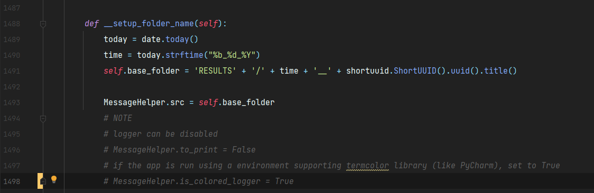

# Exstego

A small steganography app that provides certain attack and embed methods.

## Features

Demonstrates the flow of some attacks and the process of extracting and destroying data.

Logs and results are saved in the folder relative to the app: *./RESULTS/...*

**LSB steganography**

Params:

    Color channels: ['red', 'green', ['blue']
    Embed methods: ['Scatter', 'Sequential']
    Percentage: [0,..., 1]

    

| Method | Description |
| ------ | ------ |
| Sequential | Embed/ extract/ destroy starting from the first pixel |
| Scatter | Start from beggining and skip pixels in order to cover the whole file|

Percentage determens how much of the image will be altered, as well as the step of the scatter method.

 

**METADATA steganography**

Params:

    Metadata key: {metadata_type}.{metadata_namespace}.{metadata_key}

All available tags can be found on the link: [exiv2 tags list](https://exiv2.org/index.html)

Github: [exiv2 github](https://github.com/Exiv2/exiv2)

 

**BPCS steganography**

Params:

    Color channels: ['red', 'green', 'blue']
    Bit planes: [0,..., 8]

 
 

**Attacks**

Analytical (need both *stego* and *original* file, used for detecting):

- Compare bit planes of stego and original file
- Compare histograms of stego and original file

 

Stego oriented (used extraction, detection or destruction):

- Split bit planes
- Overlap bit planes
- Destroy data in LSBs
- Destroy metadata information
- Extract metadata

 
 

**Embed methods**
- LSB steganography
- METADATA steganography

## Appendix

Useful demo links:
  - [Exiv2 Github](https://github.com/Exiv2/exiv2)
  - [Exiv2 available tags list](https://exiv2.org/index.html)

 

BPCS planes overlap function was inspired by a solved problem:
- [Stackoverflow - Python image manipulation](https://stackoverflow.com/questions/58194992/python-image-manipulation-using-pillsb)

## Demo

General options. 

Note that all the images, logs and extracted data is saved inside *./RESULTS/{identifer}* folder.

Console logging can be disabled in code (./app/exstego.py):

 

LSB - embedding and extracting. 

Note that the order of the colors input is important (embedding/ extraction will insert/ read bits from that order).

https://user-images.githubusercontent.com/72694712/184732263-c2992837-a545-42c1-99d7-b9aa07c8eae7.mp4

https://user-images.githubusercontent.com/72694712/184732410-e2284480-0ffa-4f92-9c55-85f085e6e2f1.mp4

 

Embedding, extracting and destroying metadata.

https://user-images.githubusercontent.com/72694712/184732650-51d96f12-dd15-4ba6-91e3-6d0a4122d946.mp4

https://user-images.githubusercontent.com/72694712/184732717-1fd1f56f-8ef9-4bb9-aa4b-1bce271550d6.mp4

 

Overlapping and extracting bit planes. 

In this case the flag was hidden inside the first 3 bit planes. Spliting the bit planes also showed that something is present in those 3 bit planes, expecially the red channel.

https://user-images.githubusercontent.com/72694712/184733207-a25a6bcb-14ca-412b-97cc-ee9f76d74fd1.mp4

 

Comparing histograms.

https://user-images.githubusercontent.com/72694712/184734106-3754ce26-c29d-4eea-ba25-a69ddb8295d4.mp4

## Tech

**Environment:** PyCharm

**Languages:** KivyMD, Python v3.10

| PyCharm | KivyMD | Python v3.10 |
| ------ | ------ | ------ |
|  |  |   |

## Authors

- [@v-gabriel](https://github.com/v-gabriel)

